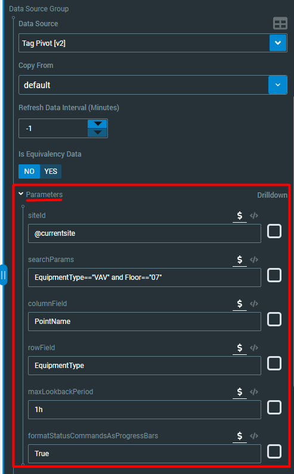

# Parameterized Basic Query

Lets take our basic query from [Basic Query](../parameters.md).

```javascript
// Typical Query
ObjectProperties
| where InstallationID == "745a7ddf-d3b0-4a3d-8400-39724f15d0ad"
| where EquipmentType == "VAV" and Floor=="07" and PointName == "Zone Air Temperature"
| join kind=inner
    (
    Timeseries
    | where InstallationId == "745a7ddf-d3b0-4a3d-8400-39724f15d0ad" and Timestamp >= ago(1d)
    )
    on $left.ObjectPropertyID == $right.ObjectPropertyId
| project EquipmentLabel, EquipmentType, PointName, Value, TimestampLocalId
| summarize arg_max(TimestampLocalId, Value) by EquipmentLabel, EquipmentType, PointName
```

## Parameterizing key values

We are going to make the following filter terms into 'string' parameters \(see [Parameter Types](parameter-types.md) for more info\):

* Site \(InstallationID\) =&gt; @siteId
* Equipment Type =&gt; @equipmentType
* Floor =&gt; @floor
* Point Name =&gt; @pointName

We do this by simply replacing the values with parameter variables \(name as you see fit\).

```javascript
// Typical Query
ObjectProperties
| where InstallationID == @siteId
| where EquipmentType == @equipmentType and Floor== @floor and PointName == @pointName
| join kind=inner
    (
    Timeseries
    | where InstallationId == @siteId and Timestamp >= ago(1d)
    )
    on $left.ObjectPropertyID == $right.ObjectPropertyId
| project EquipmentLabel, EquipmentType, PointName, Value, TimestampLocalId
| summarize arg_max(TimestampLocalId, Value) by EquipmentLabel, EquipmentType, PointName
```

## Parameterizing keywords

The fields we parameterized above were all 'strings'. There is one other field we could make use of in the basic query and that is the _**timeperiod**_ ****keyword that is used to fetch the timeseries data \(1d\).

This value is not a string, but an ADX keyword --- it is a term that ADX can process directly. We can parameterize this in the same way as the values, but we will instead set the parameter type to 'keyword' in the configuration stage. We will use the parameter name: @timeperiod.

```javascript
// Typical Query
ObjectProperties
| where InstallationID == @siteId
| where EquipmentType == @equipmentType and Floor== @floor and PointName == @pointName
| join kind=inner
    (
    Timeseries
    | where InstallationId == @siteId and Timestamp >= ago(@timeperiod)
    )
    on $left.ObjectPropertyID == $right.ObjectPropertyId
| project EquipmentLabel, EquipmentType, PointName, Value, TimestampLocalId
| summarize arg_max(TimestampLocalId, Value) by EquipmentLabel, EquipmentType, PointName
```

## Configuring parameters

We then configure the parameters in the parameter manager drawer. We need to provide:

* Parameter name \(see above\)
* Parameter type \(see [Parameter Types](parameter-types.md)\) --- in this case above they are all _**strings**_ except for the timespan which is a _**keyword**_
* Default values --- the value to use if the user does not provide a value


_Note: the image of the bindings panel above is unrelated to the basic query. It is just an example of the bindings panel._

## Setting parameter values in the Workspace builder

When the datasource is selected in the workspace bindings 'Data Source' field, the parameters that have been configured in the dataset will show under the 'Parameters' drop down and will pre-fill with the default values.



_Note: the image of the bindings panel above is unrelated to the basic query. It is just an example of the bindings panel._

