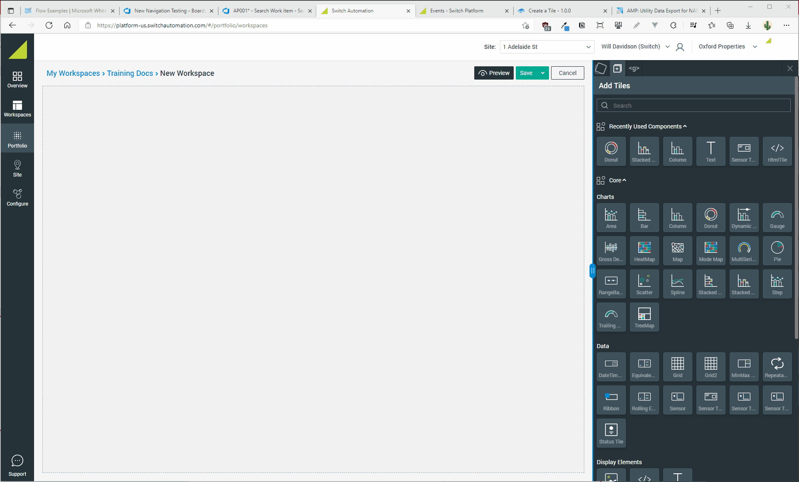

# Create a Tile

## Drag & Drop

Adding a Tile to the workspace is as simple as dragging it from the Tile Library and dropping it onto the Canvas. Further detail is provided below.

### Select a Tile from the Library

The Tile Library can be accessed from the right hand side panel as pictured below. The Tile Library is broken up into the following sections:

* **Search Bar**: search for tiles by name
* **Recently Used**: recent history of the last six tiles used
* **Core**: the core set of Tiles provided by Switch for Workspaces. It is further broken into:
  * **Charts**: standard charting tiles
  * **Data**: tiles designed to showcase data (think tables, labels, statuses, etc)
  * **Slicers**: tiles designed to filter other tiles or accept user input
  * **Display Elements**: tiles designed to add static visuals or text to a workspace
  * **Others**: any other tiles that don't fit into the above categories
* **Additional**: This section contains specialist tiles - tiles that are designed for a particular use case or feature.

.png>)

### Add to the Canvas

Creating a new Tile is as simple as dragging and dropping on the Canvas.

Notice that after a Tile has been created the right hand side panel automatically switches to show the configuration settings (data bindings) for that Tile. This is explored in detail in the following section.


If you want to go back to the Tile Library, click the :heavy_plus_sign: tab at the top of the right hand side menu.


