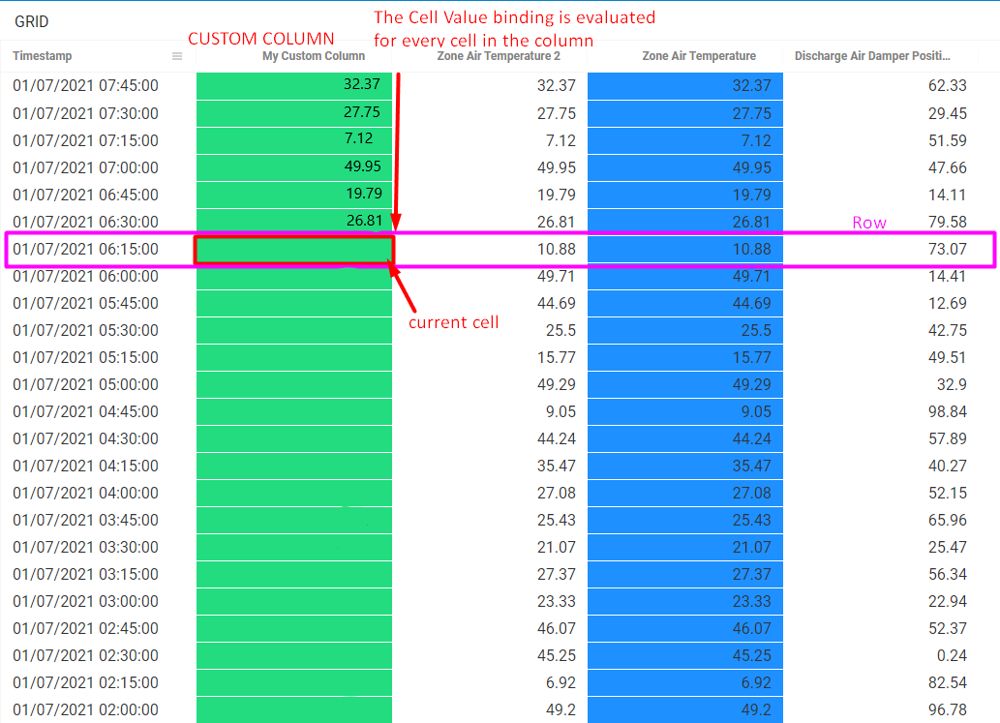

# Grid \[v2\]

## Data Bindings

The `Grid` \(v2\) tile expects **Wide** \([Wide vs. Narrow data](../query-functions/overview/wide-vs.-narrow-data.md)\) data.

### Special Grid bindings

The `Grid` tile has a number of special feature compared to the other tiles: 

1. **"Cell Renderer" bindings** These bindings allow a user to customize how the values \(and special value objects\) are displayed in the cells.
2. **"Custom Columns" bindings** These bindings allow a user to create custom calculated columns to add to the grid. After creation these columns are treated the same as normal columns returned from the data query.
3. **"Cell Conditional Formatter" bindings** These are technically a subset of the 'Cell Renderer' bindings; these bindings allow a user to customize the background color \(read: highlighting\) of each cell in the grid.

Each of these features is covered in the sections below.

### Data binding fields

| Binding | Description |
| :--- | :--- |
| **Display Name** | Column name in grid |
| **Visible** | Controls whether the column is rendered in the grid tile |
| **Column Size** | Relative size of the column compared to other columns \(default=1\) |
| **Header Align** | Text alignment of column header |
| **Value Align** | Text alignment of column cell values |
| **Cell Renderer** | Controls how a cell is displayed. Each cell renderer has a subset of bindings that are covered below |

### Query functions

The query function: [Tag Pivot](../query-functions/tag-pivot.md) can be used to generate `Grid`friendly data.

## Display Bindings

### Data Types

Data types control how the cell values are displayed in the grid and how the column filters work. Available data types are:

* string
* number
* datetime

### Cell rendering

Grid2 currently supports 4 cell renderers:

1. Text Box \(default\)
2. Pills
3. Progress Bar
4. Range Bar

Each of these renderer type configurations is covered below.

#### Text Box

The text box is the default cell renderer. It simply displays the provided value in the cell. Available bindings:

| Binding | Description |
| :--- | :--- |
| **Column Type** | Data type of column |
| **Cell Color** | Background color of the cell |
| **Date Time Format** | \(Conditional Field\) If datatype is datetime, this binding controls how the date is rendered in the grid.  |

#### Pills

Coming soon.

#### Progress Bar

Coming soon.

#### Range Bar

Coming soon.

### Custom Columns

Grid2 supports custom columns. Custom columns have all the same bindings and renderers as a normal column, plus the following additional bindings used to set up the column:

| Binding | Description |
| :--- | :--- |
| **Column Name** | The column variable name. This is the name that other columns or tiles can reference this column with |
| **Cell Value** | This sets the value of the column. The data object variables: Data and Row can be used here. |

#### Using the Data Object variables to set column values:

When a custom column is created \(or conditional formatting is applied\), the _**Cell Value**_ binding is evaluated for every cell in the column. As each cell is being evaluated, the **Row** data object variable provides access to the cell values in all columns for the particular row that is being evaluated \(the row the cell is in\).



In the figure above we are imagining we are observing the custom column midway through setting the cell values. The current cell being evaluated is highlighted in red. The values of the **Row** data object are highlighted in pink.

If our **Cell Value** binding was `Row['Zone Air Temperature']` the the value of the custom column cell would be set as **10.88**, i.e.: the value of the column 'Zone Air Temperature' for that particular row.

#### Example

An example formula for Cell Value using **Row** variable is provided below.

####  _Cell Value:_

```javascript
Row['Zone Air Temperature'] * 2 - 55 
```

Based on the figure presented above the example formula would resolve to:  10.88 \* 2 - 55 =  -33.24 for the current cell.

### Conditional formatting

Conditional formatting can be set by using the **Cell Color** binding in the Text Box cell renderer settings. The Data, Row, and Cell data objects can be used to aid in conditionally setting the cell color.

The **Row** data object behavior is documented above and can be used in the exact same way for cell coloring based on other columns in the row of the current cell.

The **Cell** data object is simply a shorthand way of referring to the value of the current cell being evaluated.


In the figure above we are again imagining we are midway through processing the conditional formatting on this column. The workspace is currently applying the conditional formatting formula to the cell highlighted in red.

If we were to call `Cell` in our **Cell Color** binding, the value returned would be the value of the current cell...that is **1.72.** This is equivalent to calling `Row['My Custom Column']` but is a bit more compact. **Cell** is useful when the cells color depends only on the value of the cell itself; if the cell color depends on the value of other column's values, then the **Row** variable needs to be used to access them.

#### Example

Two example formulas for cell coloring are provide below using both **Cell** and **Row** variables.

####  _Cell Color:_

```javascript
// BASIC FORMULA
// Depends on the cells value only
if(Cell > 7){
    return "Red"
} else {
    return "Green"
}


// COMPLEX FORMULA
// Depends on the cell value and the value of other columns in the Row
if( Cell - Row['Zone Air Temperature 2'] > 5){
    return "Red"
} else {
    return "Green"
}
```

## Tile Data Object

```javascript
[TileName]: {
    Grid: {
        selectedItem: {
            id: <id>,                 //selection Key from Bindings
            value: {<row_data>},      //all key:value column pairs for row
        },
        selectedColumn: <column_name>,//field name from column binding
        selectedCell: <cell_value>,   //value from cell in grid
        selectedRow: {<row_data>}     //all key:value column pairs for row
    }
}
```

